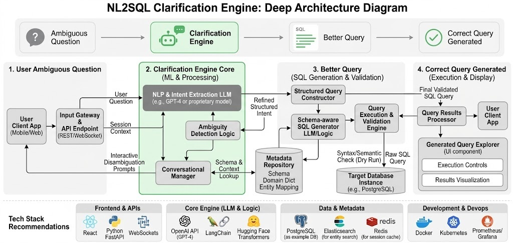

# QueryLens - Natural Language to SQL Clarification Engine



**QueryLens** is an enterprise-grade **NL2SQL Clarification Engine** designed to scan incoming natural language queries for missing temporal filters, unmapped schema attributes, ambiguous column references, and vague metric definitions. It interactively prompts the user for parameter disambiguation before executing syntactically and semantically validated SQL queries against the database.

---

## 🚀 Architecture & Tech Stack (Aligned with `QueryLens.jpg`)

| Layer | Recommended Tech Stack | Implementation Component |
| :--- | :--- | :--- |
| **Frontend & APIs** | **React**<br>**Python FastAPI**<br>**WebSockets** | Modern Vite + React dark-mode glassmorphism UI, REST API Gateway endpoints, real-time `/ws/clarify` WebSocket stream. |
| **Core Engine (ML & Logic)** | **OpenAI API (GPT-4)**<br>**LangChain**<br>**Hugging Face Transformers** | `app/llm_engine.py` (LangChain Intent Extraction & Schema-Aware SQL Constructor), `app/entity_search.py` (HF Transformers semantic entity search). |
| **Data & Metadata** | **H2 Database**<br>**Elasticsearch**<br>**Redis** | `app/db_engine.py` (H2 Database Engine executing parameterized queries on 541,910 records dataset created & loaded at startup), `app/elasticsearch_client.py` (Entity repo), `app/redis_client.py` (Session cache). |
| **Development & DevOps** | **Docker**<br>**Kubernetes**<br>**Prometheus / Grafana** | `docker-compose.yml`, `Dockerfile.backend`, `Dockerfile.frontend`, Kubernetes manifests in `k8s/`, Prometheus scraping (`/metrics`) & Grafana dashboards. |

---

## 🛠️ Quick Start (Running Locally)

### Option 1: Run Backend & Frontend Locally

#### 1. Backend (Python FastAPI)
```bash
cd backend
pip install -r requirements.txt
python -m uvicorn app.main:app --reload --port 8000
```
- REST API Documentation: [http://localhost:8000/docs](http://localhost:8000/docs)
- Prometheus Metrics: [http://localhost:8000/metrics](http://localhost:8000/metrics)
- WebSockets Endpoint: `ws://localhost:8000/ws/clarify`

#### 2. Frontend (React + Vite)
```bash
cd frontend
npm install
npm run dev
```
Open [http://localhost:3000](http://localhost:3000) in your browser.

---

### Option 2: Docker Compose (Full Stack)

To spin up all microservices (FastAPI backend, React frontend, Redis, Elasticsearch, Prometheus, and Grafana) simultaneously:

```bash
docker-compose up --build
```

Access services at:
- **QueryLens Application**: [http://localhost:3000](http://localhost:3000)
- **FastAPI REST API**: [http://localhost:8000/docs](http://localhost:8000/docs)
- **Prometheus Monitoring**: [http://localhost:9090](http://localhost:9090)
- **Grafana Metrics Dashboard**: [http://localhost:3001](http://localhost:3001)

---

### Option 3: Kubernetes Deployment

Deploy to your Kubernetes cluster:

```bash
kubectl apply -f k8s/configmap.yaml
kubectl apply -f k8s/h2-deployment.yaml
kubectl apply -f k8s/redis-deployment.yaml
kubectl apply -f k8s/elasticsearch-deployment.yaml
kubectl apply -f k8s/backend-deployment.yaml
kubectl apply -f k8s/frontend-deployment.yaml
kubectl apply -f k8s/ingress.yaml
```

---

## 🧪 Running Unit Tests

Run the backend test suite:

```bash
python -m pytest backend/tests
```

---

## 📑 Feature Specifications (FR-01 to FR-05)

- **FR-01: Ambiguity Detection**: Flags vague metrics (Revenue vs Quantity vs Order Count), missing temporal scopes, and unmapped entities.
- **FR-02: Clarification Generation**: Renders interactive disambiguation dropdowns for real-time user selection.
- **FR-03: Context Enrichment**: Merges user choices into an enriched, refined intermediate prompt.
- **FR-04: Schema-Aware SQL Generation**: Generates H2 DB compliant parameterized SQL queries with explanations and accuracy scoring.
- **FR-05: Dry Run Syntax Validation & Execution**: Performs syntax EXPLAIN checks, executes parameterized queries over 541,910 records, calculates KPIs, and visualizes results with interactive Chart.js charts and data tables.
